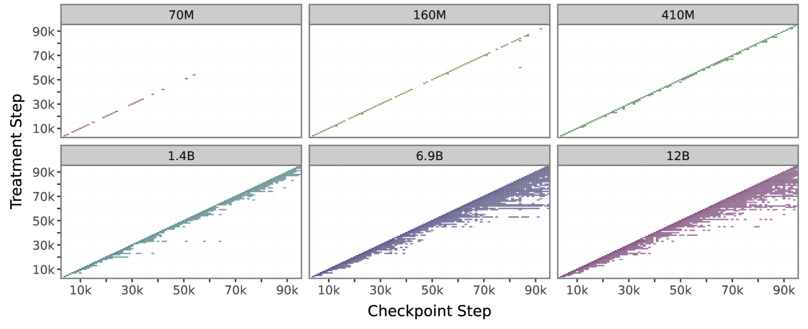

# Causal Estimation of Memorisation Profiles

<font size = "3">*Pietro Lesci, Clara Meister, Thomas Hofmann, Andreas Vlachos, and Tiago Pimentel*</font>

<br>

This is the official implementation for our ACL 2024 paper: "Causal Estimation of Memorisation Profiles".

[](https://arxiv.org/abs/2406.04327v1)

> **Abstract:** Understanding memorisation in language models has practical and societal implications, e.g., studying models' training dynamics or preventing copyright infringements. Prior work defines memorisation as the causal effect of training with an instance on the model's ability to predict that instance. This definition relies on a counterfactual: the ability to observe what would have happened had the model not seen that instance. Existing methods struggle to provide computationally efficient and accurate estimates of this counterfactual. Further, they often estimate memorisation for a model architecture rather than for a specific model instance. This paper fills an important gap in the literature, proposing a new, principled, and efficient method to estimate memorisation based on the difference-in-differences design from econometrics. Using this method, we characterise a model's memorisation profile--its memorisation trends across training--by only observing its behaviour on a small set of instances throughout training. In experiments with the Pythia model suite, we find that memorisation (i) is stronger and more persistent in larger models, (ii) is determined by data order and learning rate, and (iii) has stable trends across model sizes, thus making memorisation in larger models predictable from smaller ones.



Experimental artefacts and datasets are available on the [HuggingFace Hub](https://huggingface.co/collections/pietrolesci/memorisation-profiles-6619604c4594c878cd9d451f).
To reproduce our experiments, read below.


## 1. Setup

First, clone this repo with its submodules

```bash
# TODO: rename repo
git clone --recurse-submodules https://github.com/pietrolesci/memorization-profiles.git
```
which basically pulls [pythia](https://github.com/EleutherAI/pythia) which is used to interact with the Pile dataset.


To manage the environment we use miniconda and poetry. If you do not have them installed follow the guide below. First, install conda

```bash
curl -sL \
  "https://repo.anaconda.com/miniconda/Miniconda3-latest-Linux-x86_64.sh" > \
  "Miniconda3.sh"
bash Miniconda3.sh -b -p
rm Miniconda3.sh
source $HOME/miniconda3/bin/activate
conda init bash
```

Then, install poetry

```bash
curl -sSL https://install.python-poetry.org | python3 -
```

Finally, create the conda environment and install the dependencies

```bash
conda create -n memorisation python=3.10 -y
conda activate memorisation
poetry install --sync
```


## 2. Download Data

To download the pile training set we follow the instructions reported in the [pythia](https://github.com/EleutherAI/pythia?tab=readme-ov-file#exploring-the-dataset).
The validation split seems not currently available online. If you want to replicate our analysis, there are sources where it is possible to download the pile unofficially (e.g., `magnet:?xt=urn:btih:0d366035664fdf51cfbe9f733953ba325776e667&dn=EleutherAI_ThePile_v1` has a `pile_val.jsonl.zst`). 

To download the training data run the following script.

```bash
# download the pile and optionally process the validation split
./bin/download_data.sh
```

This scripts optionally creates the validation split if the validation file (`./data/pile-deduped-validation/raw/pile_val.jsonl`) exists.


> [!TIP]
> You can download the pile validation split from the HuggingFace Hub `pietrolesci/pile-validation`. It is still a bit confusing whether the Pile data can be released freely. Thus, we will remove this dataset if required. However, we believe this makes it easier for researchers to replicate our analysis. So, once downloaded from the HuggingFace Hub, save the dataset as a jsonl file so that the scripts work normally.


## 3. Sample Data


> [!TIP]
> You can directly get the subset of the Pile used in our experiments from the HuggingFace Hub at `pietrolesci/pile-deduped-subset`.

Sample the data from the pile as discussed in Sec. 6 in the paper: 

We sample instances from the training set in two steps: we randomly choose 10 batches for each macro-batch and sample 10 instances from each. This process results in 14.3k analysed training instances. Additionally, we sample 2k instances from the validation set to create $\mathcal{G}_{\infty}$. This process returns a panel of 16.3k instances.

```bash
./bin/sample_data.sh
```


At the end of this process you should obtain the following folder structure

```bash
data/
├── pile-deduped-train/
│   ├── document.bin  # <- make sure this is here
│   ├── document.idx  # <- make sure this is here
│   ├── .pile_data_cache/
│   └── pile-deduped-preshuffled/
│       ├── document.idx
│       ├── document-00000-of-00020.bin
│       ├── ...
│       └── document-00020-of-00020.bin
├── pile-deduped-validation/
│   ├── raw/
│   ├── tokenized/
│   └── packed/
└── pile-deduped-subset/
    ├── dataset_dict.json
    ├── train/
    └── validation/
```


## 4. Run Inference


> [!TIP]
> All artifacts are present at [https://huggingface.co/datasets/pietrolesci/pythia-deduped-stats][def]. 

To reproduce our artifacts,

```bash
./bin/run_inference.sh
```
It uses [hydra](https://hydra.cc/) for configuration management. All the configurations are in the `conf` folder. 

It will create an `./outputs/` folder with the following structure

```bash
outputs/
└── multirun/
    ├── 70m/
    ├── ...
    └── 12b/
        ├── pythia-deduped-12b-step0/
        ├── ...
        └── pythia-deduped-12b-step143000/
            ├── data-pythia-deduped-12b-step99000.jsonl  # <- delete after run is done
            ├── data-pythia-deduped-12b-step99000.parquet
            ├── hparams.yaml
            └── main.log
```

Each `data-pythia-deduped-{model_size}-step{checkpoint}.parquet` contains the raw token statistics (i.e., surprisal, accuracy, entropy, and rank). Each run might take a lot of disk space (up to 80GB for each model size). To save space you can optionally upload the individual runs for each model size on HuggingFace and remove it from local storage.

```bash
# NOTE: make sure to modify the script to accommodate your needs
./bin/upload_to_hub.sh
```

Once you have all the raw data, you can aggregate and export them to a single parquet file that is used in the analysis.

```bash
# NOTE: edit this file as convenient
./bin/export_runs.sh
```

You should obtain the following folder structure

```bash
data/pile-deduped-stats/
├── 12b.parquet
├── 6.9b.parquet
├── 2.8b.parquet  # <- we excluded this from the analysis
├── 1.4b.parquet
├── 410m.parquet
├── 160m.parquet
└── 70m.parquet
```


## 5. Run Analysis


> [!TIP]
> You can get the estimated effects (i.e., memorisation profiles) directly from the HuggingFace Hub at `pietrolesci/pythia-deduped-stats`.


Once you have the aggregated statistics at the sequence level, you can run the memorisation profile causal estimation with

```bash
# NOTE: make sure to choose the metric: acc_seq, sup_seq, avg_rank, entr_seq
./bin/run_attgt.sh
```

You can reproduce the plots in the paper using (and, perhaps, readapting) the `./scripts/make_plots.py` script.
